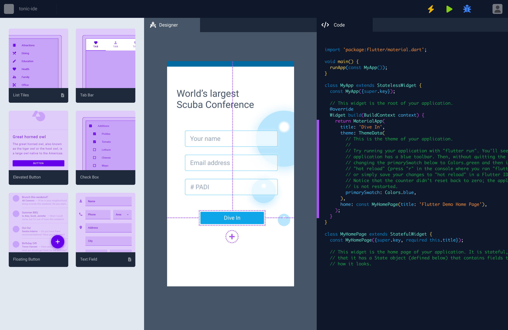

# Quinine - Flutter Tonic IDE Core

⭐️ *An IDE for developers by developers* 🥂

## Why a new IDE?

IDEs have dated, heavy interfaces with high barriers to entry, focusing on code completion rather than rapid product development.
No-code tools lack customisation, limit performance, and lock users into proprietary ecosystems, making them unsuitable for scalable applications. 
We intend to build an open-source tool which is the best of both worlds: a low-code, low-barrier-to-entry IDE which focuses on productivity by simple drag-n-drop, plug-n-play interface while at the same time offering the control and freedom to build production-grade apps at scale.

## Features

> Drag-n-Drop the easy stuff, take control of the hard stuff. It combines the best aspects of IDEs and no-code tools, focusing on improving the developer experience and productivity without sacrificing power and control.

- 👋🏼  **Drag-n-Drop UI Designer** - A drag-and-drop UI designer with a suite of community-driven component library to empower you to focus on building beautiful interfaces, so you can focus on the performance and user experience.
- 🔌  **Plug-n-Play modules** - A community-driven plugin marketplace of utilities, SDKs like payment gateways, authentication, search, server-less services etc will free you from building such workflows from scratch and instead focus on fine-tuning for scale and performance.
- 🧠  **Smart Code Assists** - A suite of code assists to help you write code faster and more efficiently. Wrap any widgets from the component library, generate boilerplate code, and more.
- 🏎️  **Light-weight and Fast** - A light-weight and fast IDE that is built for speed and performance. No more waiting for your IDE to load. We aim to stay below 500MB of RAM usage.

## Key Tenets

- *Focus on developer experience and productivity*: The primary focus of Quinine IDE should be to improve the overall experience and productivity of developers using the platform.
- *Low-code, high flexibility*: The platform should offer a low-code environment that allows for flexibility and customization, while also providing powerful tools for those who want to dive into code.
- *Community-driven development*: Quinine IDE should foster a strong and vibrant community that contributes to the platform's growth and development.
- *Quality over quantity*: Prioritise quality over quantity when it comes to features, components, and plugins. Ensure that each addition to the platform meets a high standard of quality and usability.
- *Openness and transparency*: Foster an open and transparent development process that encourages participation and feedback from within the community.
- *Platform agnostic*: While the initial focus is on Flutter, the vision for Quinine IDE is to become platform agnostic with the aim of supporting other frameworks and languages in the future.
- *Innovation*: Quinine IDE should continually innovate and push the boundaries of what’s possible in low-code development, always keeping an eye on the latest trends and technologies.

## Progress Update

We're excited to share the latest progress on Tonic IDE with our amazing community members! Here's what's been happening:

- ✨ **Early Stages of Development**: Tonic IDE is steadily taking shape, and we're working tirelessly to bring you a powerful and user-friendly IDE experience. We're planning to release an Alpha version by the end of July, packed with features that will enhance your development workflow.
- ⚡️ **VSCode-like Speed, Android Studio-like Ease of Use**: Our team is dedicated to creating an IDE that combines the lightning-fast performance of VSCode with the user-friendly interface of Android Studio. We want to provide you with a seamless and efficient coding experience that boosts your productivity.
- 💡 **ChatGPT Boost**: We're thrilled to announce that we're incorporating the ChatGPT model into Tonic IDE to provide intelligent code assistance and enhance your development process. Get ready to experience the power of AI in your coding journey!

###  🔍 Track Our Progress
Stay updated with the latest developments by tracking our progress on our GitHub project board. Visit the following link to see our milestones, tasks, and the overall progress of Tonic IDE: [Tonic IDE Progress Board](https://github.com/users/5hirish/projects/4)

We appreciate your support and patience as we continue to build and refine Tonic IDE. Your feedback and contributions are invaluable to us. Together, we're creating a game-changing IDE for Flutter developers.

## Contribute

We welcome contributions from the community! Please read our [contributing guidelines](https://github.com/5hirish/quinine/blob/release/CONTRIBUTING.md) and [wiki](https://github.com/5hirish/quinine/wiki) before submitting a pull request.

## Join the Community

- 🚀  **Discord** - [Tonic Flutter IDE](https://discord.gg/Yh5Nkrznaw)
- 📺  **YouTube** - [Tonic - Flutter IDE by devs for devs](https://www.youtube.com/@tonic_ide)
- 📚  **Wiki** - [Tonic Wiki](https://github.com/5hirish/quinine/wiki)

## Core Team
Let's get to know the passionate minds behind Tonic IDE:

1. *Shirish [@5hirish](https://twitter.com/5hirish)* : Core maintainer of Tonic IDE. Loves hiking and swimming on the weekends. Planning to get my diving license by the end of July!
2. *Marvin [@diazmarv](https://twitter.com/diazmarv)* : Community leader for Tonic IDE. Loves to run and shred guitar on the weekends.

## License

Quinine is available under the [Apache License 2.0](https://github.com/5hirish/quinine/blob/release/LICENSE). Use it wisely.

## About

> Quinine is the core library that powers Tonic, a feature-rich low-code Flutter IDE designed to improve the development experience for Flutter developers. Quinine provides essential functionalities such as the low-code designer, syntax highlighting, autocompletion, error checking, and code navigation, making it the backbone of Tonic.

*Quinine gets its name from the natural compound quinine, which has been historically used as a key ingredient in tonic water. In the 19th century, quinine was discovered to have antimalarial properties and was extracted from the bark of the cinchona tree. British officials stationed in India mixed quinine with sugar and water to make it more palatable, creating the first tonic water. Later, it became popular to mix tonic water with gin, giving birth to the classic gin and tonic cocktail.*

*In a similar fashion, Quinine serves as the essential ingredient that gives Tonic its powerful capabilities. By integrating Quinine into Tonic, developers can enjoy a seamless and efficient coding experience when working with Flutter projects.*
